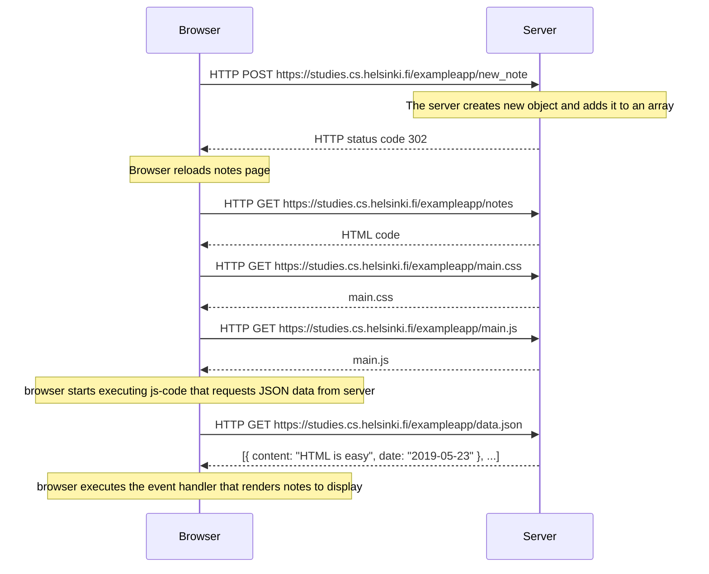

```mermaid

sequenceDiagram
    Browser->>Server: HTTP POST https://studies.cs.helsinki.fi/exampleapp/new_note
    Note over Server: The server creates new object and adds it to an array
    Server-->>Browser: HTTP status code 302
    Note over Browser: Browser reloads notes page

    Browser->>Server: HTTP GET https://studies.cs.helsinki.fi/exampleapp/notes
    Server-->>Browser: HTML code
    Browser->>Server: HTTP GET https://studies.cs.helsinki.fi/exampleapp/main.css
    Server-->>Browser: main.css
    Browser->>Server: HTTP GET https://studies.cs.helsinki.fi/exampleapp/main.js
    Server-->>Browser: main.js
    Note over Browser: browser starts executing js-code that requests JSON data from server 
    Browser->>Server: HTTP GET https://studies.cs.helsinki.fi/exampleapp/data.json
    Server-->>Browser: [{ content: "HTML is easy", date: "2019-05-23" }, ...]

    Note over Browser: browser executes the event handler that renders notes to display

```
